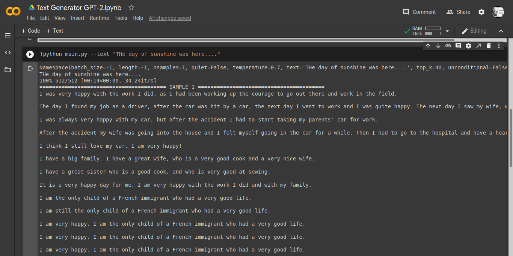

# Para-Writer-GPT-2
This is a free Auto Sentence completion script made using the famous OpenAI's GPT-2 Model (40GB Web Version). Just enter your initial text and run the columns as you go...

### How to use Para-Writer-GPT-2
1. Click here 

                OR 
                
Just Navigate to this Link: https://colab.research.google.com/github/CrazyCoder009/Para-Writer-GPT-2/blob/master/Text_Generator_GPT_2.ipynb

2. Enter your text between **" "** in the last cell and run all the cells one-by-one from top to bottom.

### RRN 
### www.github.com/CrazyCoder009

